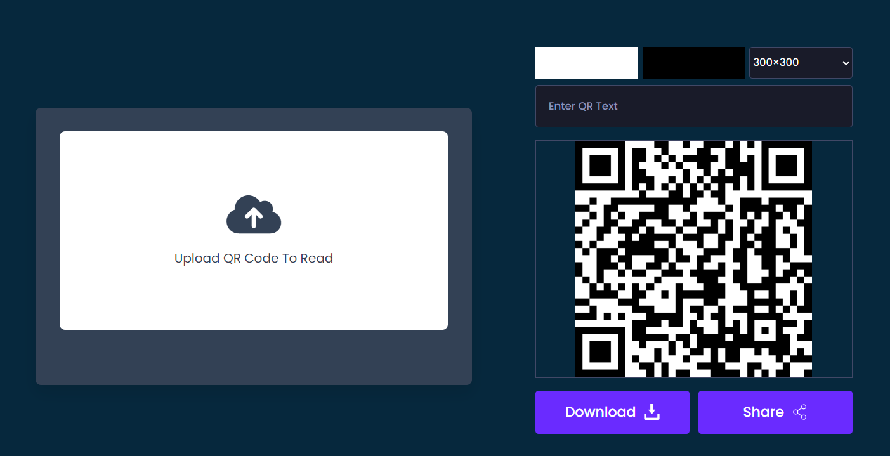

# Translator App
 •	Language:  
 
 
 
# API
- Generator QR Code : https://cdnjs.com/libraries/qrcodejs
- Reader QR Code : https://goqr.me/api/

# Screenshot
- Here we have the project screenshot :

Default

Reader and Generator QR Code

